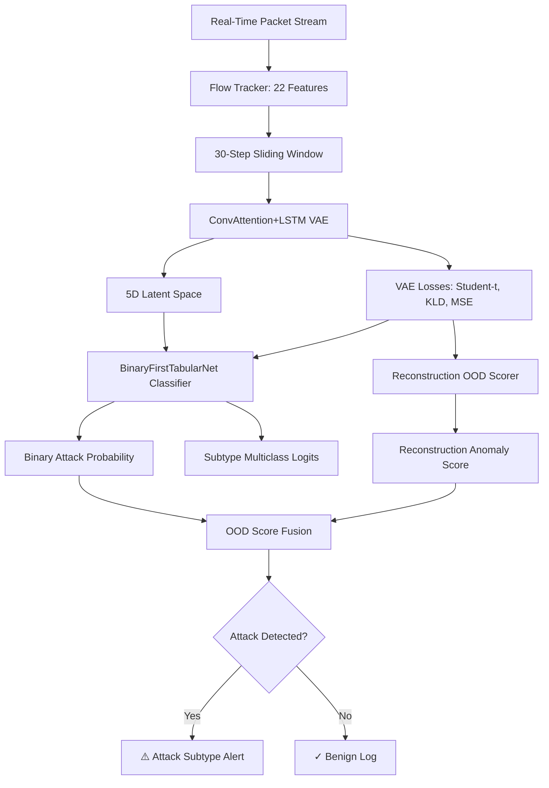

# VAE & Neural Network Open-World IDS (IPD-IDS)

An AI-powered Network Intrusion Detection System (IDS) that uses a hybrid deep learning architecture—combining a **ConvAttention+LSTM Variational Autoencoder (VAE)** and a **Domain-Guarded Neural Tabular Classifier**—to detect known attacks and discover novel, unseen (Out-of-Distribution) threats in real-time network traffic.

---

## 🔍 Methodology & CatBoost Clarification

Although early architecture concepts or draft reports refer to this system as a **VAE-CatBoost** hybrid, the final implementation is a **fully neural deep learning pipeline** to eliminate runtime dependencies, optimize prediction latency, and enable end-to-end domain generalization:
- **CatBoost (Pre-Training Feature Selection Only)**: CatBoost is utilized strictly during the offline training setup (see [cic-ids-vae.ipynb](file:///c:/Users/vihaa/OneDrive/Documents/IPD-IDS/cic-ids-vae.ipynb)) to run hyperparameter optimization (Optuna) and compute **SHAP (SHAPley Additive exPlanations)** values. This determines the top 22 most predictive features to extract from raw network flows.
- **ConvAttention+LSTM VAE (Neural)**: Compresses the sequence of 22 input features into a 5-dimensional latent space and computes reconstruction losses (Student-t, KLD, and MSE) to score anomaly deviations from benign baseline traffic.
- **BinaryFirstTabularNet (Neural)**: A custom tabular neural network that uses the VAE's latent space and losses as input features to perform binary attack prediction and multiclass subtype classification.
- **Sniffer Engine (Purely Neural)**: The real-time network sniffer (`realtime_capture.py`) runs this inference pipeline entirely on PyTorch with no runtime dependency on CatBoost.

---

## 🛠 System Architecture

The detection pipeline consists of two primary neural components:



1. **ConvAttention+LSTM VAE**:
   - Compresses 22 input features across a 30-step sliding window of sequential flows into a 5-dimensional latent representation.
   - Computes reconstruction errors (`student_loss`, `kld_loss`, `mse_loss`) to score deviations from benign baseline traffic.
2. **BinaryFirstTabularNet Classifier**:
   - Takes the 5 latent dimensions and 3 VAE loss components as input.
   - Outputs binary attack probabilities and multiclass subtype predictions (`DoS`, `DDoS`, `Brute-Force`, `Web Attack`).
3. **OOD Score Fusion**:
   - Fuses VAE reconstruction OOD score with classifier confidence:
     $$\text{attack\_score} = 0.65 \times \text{binary\_prob} + 0.35 \times \text{recon\_score}$$
   - If `attack_score >= 0.694`, an alert is fired with the classified subtype.

---

## 📂 Project Structure

- `realtime_capture.py` - The real-time packet capture, flow extraction, and classification engine.
- `run_capture_admin.bat` - Batch file to easily launch the capture engine with administrative privileges.
- `cic_neural.ipynb` / `cic_neural.py` - Classifier training, domain adaptation (GRL), and threshold calibration notebook/script.
- `cic-ids-vae.ipynb` / `cic_ids_vae_benchmark.py` - VAE model definition, training, and latency benchmarking.
- `recalibrate_thresholds.py` - Script to calibrate baseline reconstruction percentiles.
- `vae_primary_model.pth` - Trained VAE weights.
- `nn_classifier_model.pth` - Trained neural classifier weights.
- `nn_scaler.joblib` - Scaler for tabular classifier input features.
- `column_min_max_mapping.csv` - Min-max bounds for VAE input features.
- `anomaly_thresholds.joblib` - Reconstruction scorer percentiles and calibrated decision thresholds.

---

## 🚀 Running the System

### Prerequisites
Install Python dependencies:
```bash
pip install torch numpy pandas scikit-learn joblib scapy
```

### Real-Time Intrusion Detection
To run the sniffer and classify live network traffic:

1. **Option 1 (Recommended)**: Right-click `run_capture_admin.bat` and select **Run as Administrator** (required for raw packet socket access on Windows).
2. **Option 2 (CLI)**: Run the python script in an elevated shell:
   ```bash
   python realtime_capture.py --device cpu --duration 3600
   ```
